Веб-сервис для подготовки к техническим собеседованиям с использованием искусственного интеллекта.  
Проект моделирует реальное интервью: ИИ-интервьюер задаёт вопросы, озвучивает их, распознаёт ответы пользователя и формирует отчёт с оценкой и обратной связью.

### Функционал
---
- Авторизация пользователей
- Тренировочные собеседования с ИИ-интервьюером (синтез и распознавание речи)
- Автоматический анализ интервью и отчёт
- База теоретических вопросов
- База алгоритмических задач с поиском, фильтрацией и пользовательскими коллекциями
- Отслеживание общего прогресса изучения теории
- Создание и редактирование текстовых заметок

### Cтек технологий
---
##### Frontend
- React
- Tailwind CSS
- TypeScript
- Zustand

##### Backend: 
- NestJS
- PostgreSQL
- Prisma ORM
- JWT-аутентификация

##### AI / Speech:
- GigaChat API — генерация вопросов и анализ ответов, формирование отчета
- SaluteSpeech API — синтез и распознавание речи

### Презентация
---
[Презентация со скриншотами интерфейса](about-project/presentation.pdf)


### Запуск проекта
---
##### Требования
- Docker & Docker Compose
- Node.js
- API-ключи для доступа к GigaChat и SaluteSpeech
##### Установка
```
# запуск базы данных
docker compose up -d
```

```
# Клонировать репозиторий
git clone https://github.com/sylvariu/interview-platform.git
cd interview-platform

# Установить зависимости (backend)
cd backend
npm install

# Установить зависимости (frontend)
cd ../frontend
npm install
```
##### Запуск
```
# Backend
cd backend
npx prisma migrate dev
npm run start:dev

# Frontend
cd ../frontend
npm run dev
```

### База данных
---

